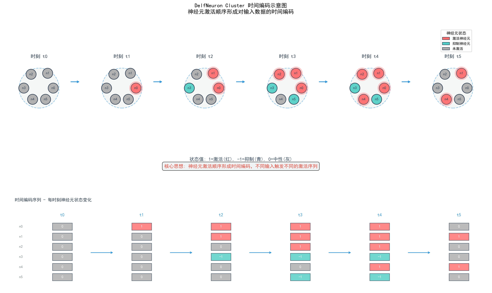

# The fundamental idea of deep self-organizing neural networks
Author： 大饼博士，188997452@qq.com;\
Co-authors： xxx


主要涉及到激活函数的设计，以及如何实现时间编码。时间编码是指神经元激活顺序形成的时间序列，不同输入触发不同的激活序列。


Fig2.1. 时间编码示意图

# 激活函数的设计（仅提供一个思路）

传统激活函数（ReLU、sigmoid）只表达"激活程度"，没有"抑制"概念。在 DelfNet 框架下，可以有以下几种设计思路：

## 方案对比

| 方案 | 原理 | 优点 | 缺点 |
|------|------|------|------|
| **tanh 类** | 输出 ∈ [-1, 1]，负值=抑制 | 简单，现成可用 | 抑制语义不够明确 |
| **双向激活函数** | 设计 f(x) 输出正负两种状态 | 语义清晰 | 需要新设计 |
| **软竞争机制** | 类似 softmax，神经元间竞争 | 自然形成抑制 | 计算复杂 |
| **显式抑制通道** | 每个神经元有激活+抑制两个输出 | 最明确 | 参数翻倍 |

## 具体设计思路

### 1. tanh/Leaky tanh（最简单）

```python
# 传统 tanh：负值自然表示抑制
output = tanh(x)  # 范围 [-1, 1]
# output > 0: 激活状态
# output < 0: 抑制状态
# output ≈ 0: 中性状态
```

### 2. 双向激活函数（推荐设计）

```python
def bidirectional_activation(x, threshold=0):
    """
    输出两个通道：激活值和抑制值
    """
    # 激活通道：正值部分
    activate = max(0, x - threshold)  # 或用 softplus
    
    # 抑制通道：负值部分的绝对值
    inhibit = max(0, threshold - x)  # 或用 sigmoid 反向
    
    return activate, inhibit  # 状态由两者相对大小决定
```

### 3. 簇内竞争抑制（类似 softmax）

```python
def cluster_competition(raw_outputs, cluster_mask):
    """
    簇内神经元竞争：强者激活，弱者抑制
    """
    # 对簇内神经元做 softmax-like 竞争
    compete_weights = softmax(raw_outputs * cluster_mask)
    
    # 高权重 → 激活，低权重 → 抑制
    # 用阈值区分状态
    states = torch.where(compete_weights > threshold, 
                         'active', 'inhibit')
    return states
```

### 4. 时间步上的状态转换

```python
def state_transition(prev_state, current_input, delta_weight):
    """
    根据增量权重和输入，状态可以转换
    """
    # 神经元状态：激活/抑制/中性
    new_potential = prev_state + delta_weight * current_input
    
    # 状态判定
    if new_potential > activate_threshold:
        state = 'active'
    elif new_potential < inhibit_threshold:
        state = 'inhibit'
    else:
        state = 'neutral'
    
    return state, new_potential
```

## 核心设计原则

1. **抑制要有语义**：不仅仅是"低激活"，而是"主动阻止其他神经元"
2. **抑制要可传播**：抑制状态应该能通过连接影响下游神经元
3. **抑制要有时间特性**：有些神经元快速抑制，有些慢速抑制（体现时间编码）

## 一个可能的实现框架

```python
class DelfNeuron:
    def __init__(self):
        self.potential = 0      # 膜电位
        self.state = 'neutral'  # 状态
        self.response_time = 1  # 响应时间步（快/慢）
    
    def update(self, input_signal, delta_weight):
        # 更新电位
        self.potential += delta_weight * input_signal
        
        # 状态判定（带阈值）
        if self.potential > 0.5:
            self.state = 'active'
            self.output = self.potential  # 正向输出
        elif self.potential < -0.3:
            self.state = 'inhibit'
            self.output = -abs(self.potential)  # 抑制输出（负值）
        else:
            self.state = 'neutral'
            self.output = 0
```

---

**总结**：抑制状态的数学表达可以是 **负值输出** 或 **低竞争权重**，关键是让这个状态能够**主动影响其他神经元**（比如抑制性连接使下游电位降低），而不是简单的"不激活"。
