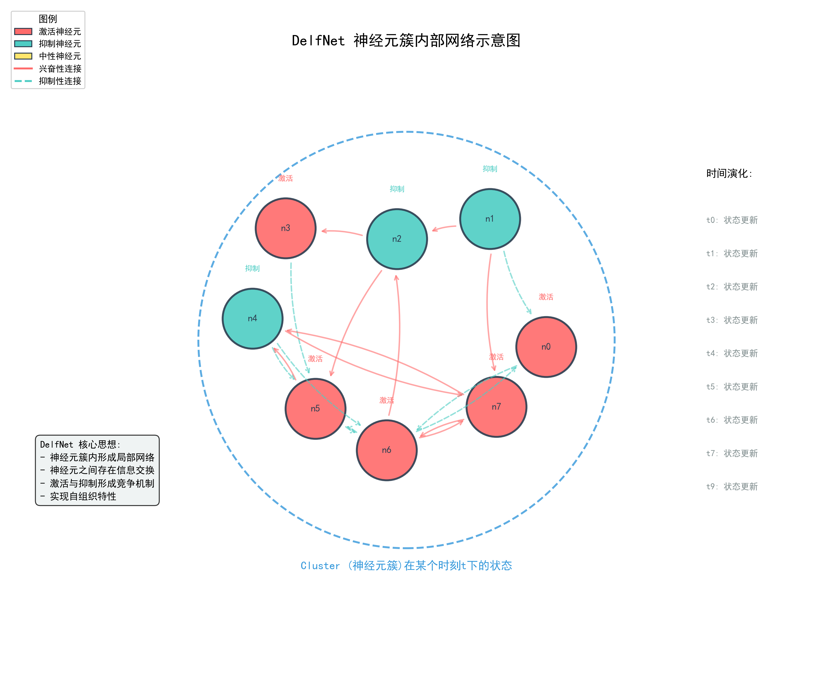

# The fundamental idea of deep self-organizing neural networks
Author： 大饼博士，188997452@qq.com;\
Co-authors： xxx


## 3. 基本研究方案

### 3.1 设计限制条件
暂时给本文的初始设计添加一些限制条件，未来工作可以不受此限制：
- 训练算法本身必须是基于BP的梯度下降算法，我不想引入推翻BP的新方案，那就过于复杂了；
- 暂时不改变现有的Transformer Block内的基本结构；
- 对比时，尽量保持参数量规模，让模型保持和当前Transformer模型具有近似的表达能力上限。
- 计算模式必须兼容当前主流的GPU/NPU的核心结构（tensor core/cube core）
- 如果有新的硬件支持，有机会可以性能更优（重点关注推理）
- 一簇神经元的权重参数在时间t步骤上是逐步变化的，而不是瞬时的
- 既要保持足够大的参数量，又不需要80层甚至100+层完全“独立”的Transformer block

### 3.2 核心方案：增量式权重参数 + 深度自组织神经网络
综上，有没有什么简单、有效的方法（或者思路），让我们可以去尝试解决之前的问题，并且满足以上限制条件？

#### 3.2.1 增量式权重参数
方案的核心设计是增量式的神经网络权重参数：

$$
W0 \\
W1 = W0 + △1 \\
W2 = W1 + △2 = W0 + △1 + △2 \\
W3 = W2 + △3 = W1 + △1 + △2 + △3 \\
... \\
W9 = W8 + △9 = W0 + △1 + △2 + △3 + △4 + △5 + △6 + △7 + △8 + △9 \\
...
$$

每一层的参数，都是前一层的参数加上这一层的增量参数。而网络整体的自由参数量是没有改变的。原来总参数量是 $W0+W1+W2+W3+...+W9$，现在变成了 $W0+△1+△2+△3+...+△9$。确保$△$和$W$的大小是相同的。


Fig1. 增量式神经网络结构设计与标准DNN结构的对比

可以发现，这种结构设计是完全可以回退到标准的DNN结构的。如果我们已经有独立的$W0,W1,...$，当$△1=W1-W0$，$△2=W2-W1$，$△3=W3-W2,...$时，就退化为标准的DNN结构了。但这样没有意义，因为我们的目标是增量式的设计，而不是独立的设计。我们希望$△i$可以建模出神经元的变化。下面会讨论这一基本思路。

#### 3.2.2 深度自组织神经网络

先解释一下什么是自组织神经网络（self-organizing neural networks）。这个设计和概念的来源是经典的SOM模型。SOM模型是一种无监督学习模型，它的目标是将高维数据映射到低维空间中，并且保持数据之间的距离关系。本质上，SOM可以看成是对一层或者叫一簇神经元之间进行建模，通过神经元之间互相影响，来实现对数据的特征学习。这种层内神经元的建模，恰恰是现在主流神经网络模型, 如transformer/CNN等，所欠缺的。类似的建模思想，还出现在著名的hopfield网络中。

而“深度自组织神经网络”，顾名思义，就是在自组织神经网络的基础上，增加了深度（多层）的维度。在第1章节中我们已经介绍过，我们可以考虑将Transformer模型按照Block顺序分组，比如每k层一组，作为一簇神经元。本文我们先采用k=10来代入说明，方便理解，当k=1时，就完全退化为标准的Transformer网络了。如L=80的Transformer模型，可以看成8个簇前后连接组成的一个神经网络：
```
[W0, W1, W2, ..., W9]       --> 
[W10, W11, W12, ..., W19]   --> 
...
[W70, W71, W72, ..., W79]   -->
...
```


把$W0,W10,...$, 分别用独立初始化的参数表达，而剩余其他层的参数$Wi$，都用增量式的设计。设计上的限制仅仅是每一簇内的Blocks需要神经元的数量一致。这是一种比较折中的设计，既保留了多层/深层的表达能力，也不会让模型的参数间的依赖过深。具体k是多少合适，需要实验或者更多理论论证。


Fig2. 神经元簇内部网络示意图


很容易发现，现在的Transformer模型，每一个transformer block中的神经元数量都是一致的，完全可以套用上述方法，做一个等价变化。哪怕在常规训练之后也是可以的。但仅仅是等价变化就没有意义了，上述算法在训练阶段出现了新的变化：

比如考察L=2层，它的权重参数为： 
$$W2 = W0 + △1 + △2$$
那么这一层的回传梯度$d_y$就不仅仅影响$△2$，同时也影响了$△1$以及$W0$，从而影响到前面的所有层的参数。是不是很有意思？后面层的参数在更新时，会影响前面层的参数。可以利用现有的pytorch这样的框架，来实现这个设计。

#### 3.2.3 设计总结
到这里，我们已经完成了最基本的模型结构性方案设计，它的主要特点是：

1） 自组织神经网络结构：神经元形成了簇的结构，在文本的语境下，簇才是真正的“一层”神经元。信号在一簇神经元内不是瞬时处理的，而是需要进行一段时间的延迟，才能影响到下一簇神经元。我们把这一段时间延迟，离散成k步，每一步叫做一个“时间步长”，也就是说信号在一簇神经元内被处理了k次(或最多k次)，而不是1次。

2） 增量式的神经网络权重参数设计：每一个Block的参数$Wi$，都是前一个Block的参数$W(i-1)$加上增量参数$△i$来表示。

✨ 当然，我们不满足于对现有网络模型的等价变化，我们希望$△i$可以建模出神经元在完成前序信息处理之后的变化。比如，$△l_{ji}，i=1,2,...,m$的每一个维度在数值上的扩大或者缩小，可以体现第$l$个block的神经元$j$对输入信号m个分量的加强或者抑制（回到Transformer网络的语境下，一个block的输入和输出就是一个token的hidden states，用h表示；往往我们可以设计block的input size = output size，这样我们就可以把前一个block的输出理解成同一簇神经元在前一个t-1时刻的输出状态）。 当$△l_{ji} = 0$，说明这一个权重参数在下一个时刻不需要改变。

✨ 让我们先忽略正负数值“扩大”与“缩小”在物理上的含义，用通俗的语音来描述本文想传递的概念；实际在方案设计时，可能会与激活函数的选择，比如ReLU就只留下了正的激活信号，而所有pre-activation值是负的都没有触发神经元的信号传递动作，还处于“欠激活”状态。

✨ 激活函数的选择，也许在本文的思路下，会扮演非常重要的神经元模型建模的价值，而不仅仅是做一次数值上的非线性变换。而现有transformer网络的设计，可能不一定匹配本文的设计思路，比如在FFN的激活函数之后如果还有其他计算，就可能会与本文的设计思路冲突。也许我们很难直接把一个标准的transformer网络简单地改造成DelfNet，但是谁知道呢？

✨ 有没有可能先从CNN网络开始验证呢？比如ResNet。


