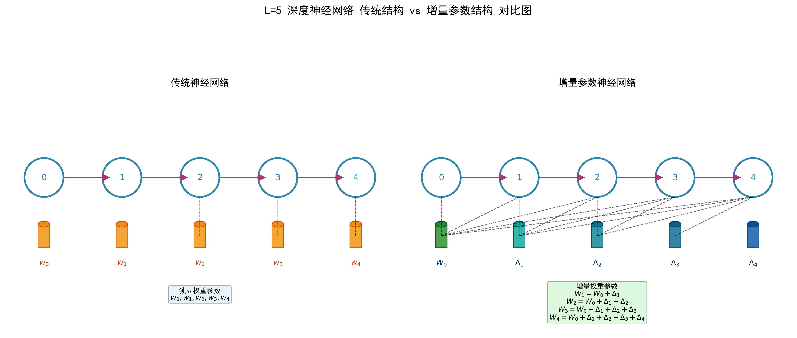

# The fundamental idea of deep self-organizing neural networks
Author： 大饼博士，188997452@qq.com;\
Co-authors： xxx

注1：这一章节用于讨论可行的研究方向，有兴趣的同学可以一起思考。

## 初始研究方案

### 设计限制条件
我给本文的设计一些限制条件：
- 训练算法本身必须是基于BP的梯度下降算法，我不想引入推翻BP的新方案，那就过于复杂了；
- 不改变现有的Transformer模型的基本结构；对比时，不改变参数量规模，让模型保持和当前Transformer模型近似的表达能力。如果强行减少参数来提升效率，这个和用一个小模型代替大模型就没有什么区别了。
- 计算模式必须兼容当前主流的GPU/NPU的核心结构（tensor core/cube core）
- 如果有新的硬件支持，有机会可以性能更优（重点关注推理）

### 核心方案：基于增量式神经网络结构设计的深度自组织神经网络
综上，有没有什么简单、有效的方法（或者思路），让我们可以去尝试解决之前的问题，并且满足以上几个限制条件？

我的思路来自于以下几个考虑：
- a. 顺序上后面的层要能利用前面层的参数，来组成自己参数
- b. 我们既要保持足够大的参数量，又不需要80层甚至100+层完全“独立”的Transformer block

方案的核心设计是增量式的神经网络结构设计：

$$
W0 \\
W1 = W0 + △1 \\
W2 = W1 + △2 = W0 + △1 + △2 \\
W3 = W2 + △3 = W1 + △1 + △2 + △3 \\
... \\
W9 = W8 + △9 = W0 + △1 + △2 + △3 + △4 + △5 + △6 + △7 + △8 + △9 \\
$$

你看，每一层的参数，都是前一层的参数，加上这一层的增量参数。而网络整体的自由参数量是没有改变的。原来总参数量是 $W0+W1+W2+W3+...+W9$，现在变成了 $W0+△1+△2+△3+...+△9$。而△和W的大小是相同的。

### 深度自组织神经网络

当然，我们可以考虑分大组，比如每k层为一组，然后每一组的参数，用增量式的设计。本文我们先采用k=10来带入说明，方便理解，当k=1时，就完全退化为标准的常见DNN网络了。

[W0, W1, W2, ..., W9] --> 
[W10, W11, W12, ..., W19] --> 
...
[W70, W71, W72, ..., W79]

把W0,W10,W20,...W70, 分别用独立的参数表达，而剩余其他层的参数，都用增量式的设计。这是一种比较折中的设计，既不会改变模型的表达能力，也不会改变模型的参数量，同时也不会让模型的层间依赖过深，避免过多训练依赖问题。具体k是多少合适，需要实验或者理论论证。

很容易想到，现在的Transformer模型，每一个transformer block中的神经元数量都是一致的，完全可以套用上述的方法，做一个等价变化。哪怕在常规训练之后也是可以的。但是，如果仅仅是等价变化就没有意义了，上述算法在训练阶段出现了新的变化：

比如L=2层，它的权重参数为： 
$$W2 = W0 + △1 + △2$$
那么这一层的数据梯度$d_y$就不仅仅影响$△2$了，可以同时影响$△1$和$△2$以及$W0$，从而影响到前面的所有层的参数了！是不是很有意思？套用标准的BP算法，是可以完成这个更新的。可以复用现有的比如像pytorch这样的框架，来实现这个设计。

- 我想，既然每一层的参数都是独立的，那么我是否可以考虑，把每一层的参数，拆分成两个部分：一个是当前层的参数，另一个是前一层的参数。当前层的参数，我仍然保持和当前Transformer模型相同的设计，即$W_l$和$b_l$；前一层的参数，我则用一个增量式的设计，即$W_{l-1}$和$b_{l-1}$。
- 

## 推理效率提升

如何用上面的设计，来提升推理效率？